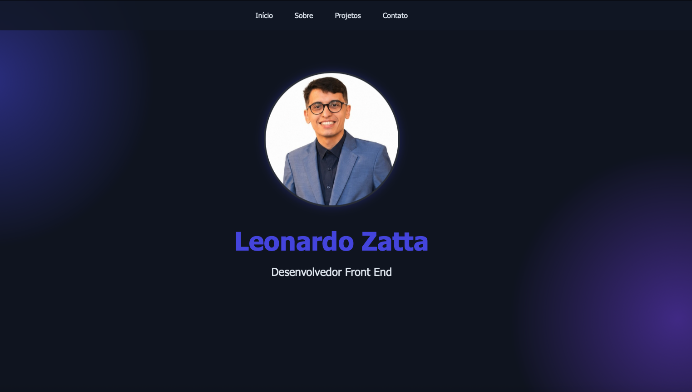
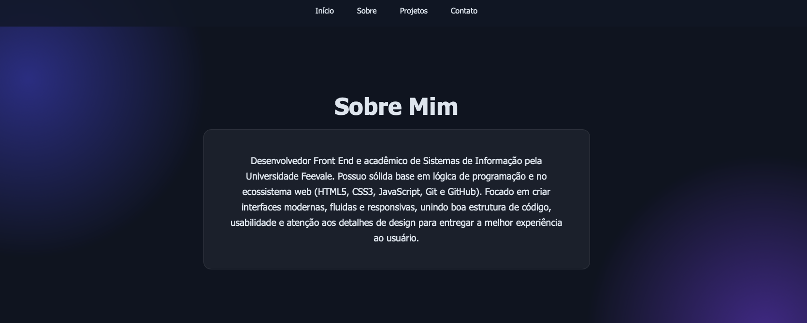
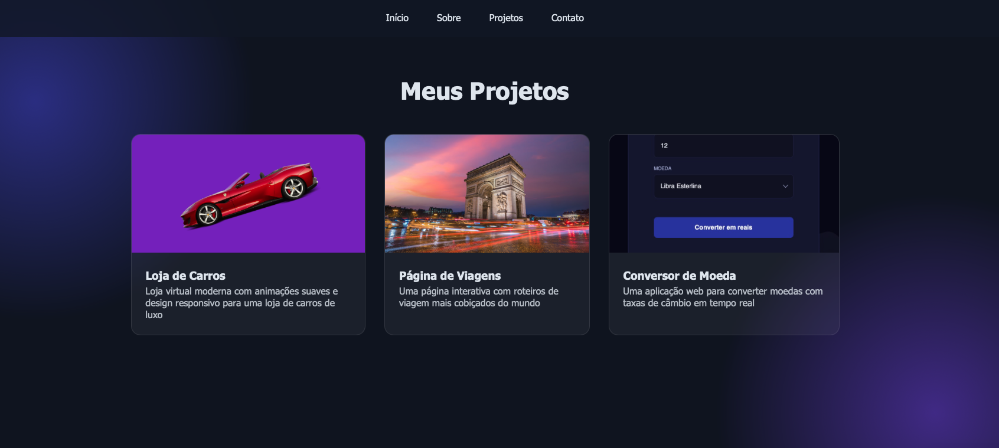
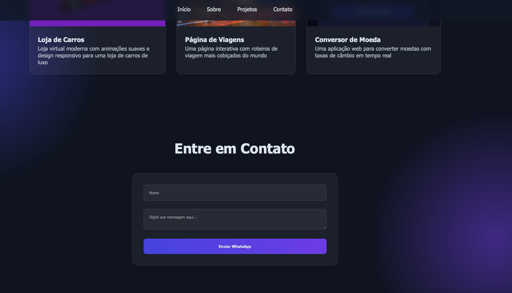

# 💻 Portfólio - Leonardo Zatta

Repositório do meu portfólio pessoal como Desenvolvedor Front End. O projeto foi construído para apresentar meus principais projetos, habilidades técnicas, formação acadêmica e meios de contato de forma moderna, fluida e responsiva.

---

## 🚀 Tecnologias Utilizadas

- **HTML**: Estruturação semântica e acessível.
- **CSS**: Estilização moderna, layout responsivo e animações fluidas.
- **JavaScript**: Interatividade e manipulação dinâmica do DOM.
- **Git & GitHub**: Controle de versão e hospedagem do código.

---

## 🎨 Funcionalidades e Seções

- **Início / Hero**: Apresentação principal com design em tom escuro (*dark theme*) e destaques visuais.

- **Sobre Mim**: Breve resumo da minha trajetória, formação em Sistemas de Informação na Universidade Feevale e foco de atuação.

- **Projetos**: Vitrine interativa apresentando minhas aplicações (Loja de Carros, Página de Viagens, Conversor de Moeda, entre outros).

- **Contato**: Formulário integrado para envio rápido de mensagem direto via WhatsApp.


---

## 🛠️ Como Executar o Projeto Localmente

1. **Clone este repositório:**
   ```bash
   git clone [https://github.com/seu-usuario/seu-repositorio.git](https://github.com/seu-usuario/seu-repositorio.git)